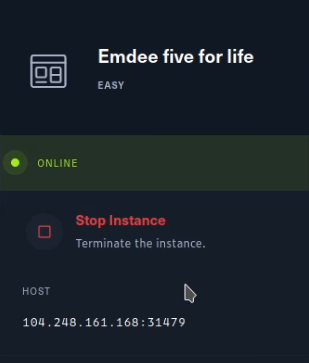
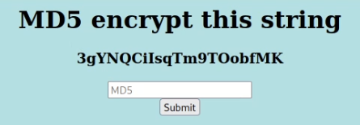
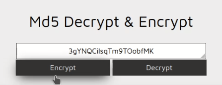
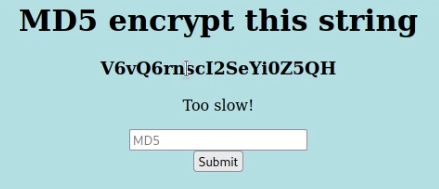

<a class="domain reader-domain" href="https://medium.com/@kagasirat/hacking-emdee-five-for-life-baeb8c9c8bac">medium.com</a>

<h1 class="reader-title">Hacking “Emdee five for life” - Murat Aydin - Medium</h1>

Murat Aydin

2 minutes

<blockquote>
<strong>Cyber Security Education</strong> <strong>Level:</strong> Easy <strong>Challenge:</strong> Emdee five for life by Hack the box (HTB)
</blockquote>
A very easy challenge by HTB — Emdee five for life — that shows why <strong>programming</strong> is crucial for basic challenges in <strong>cyber security</strong>.
<figure>

</figure>
This
small entry challenge tells you how to do web requests with code. Later
on, in more intermediate trainings, similar basic code may be in your <strong>web exploits</strong> for penetration testing.
<figure>

</figure>
Our task is to encrypt the given string as MD5. <em>Just search for MD5 encryption on the internet and you will find plenty of online tools.</em>
<figure>

<figcaption data-selectable-paragraph="">md5decrypt.net</figcaption></figure>
After you have entered the decrypted value, the challenge will tell you that you are “Too Slow”, will give you another string.
<figure>

<figcaption data-selectable-paragraph="">MD5 value entry</figcaption></figure><figure>

<figcaption data-selectable-paragraph="">Too slow!</figcaption></figure>
At
this point, it is clear that it is not just possible to continue with a
manual entry. As soon as the string is visible, we have to <strong>answer</strong> with the decrypted value <strong>immediately</strong>. We will do it with a <strong>Python</strong> script, and with one of the most <strong>basic logic</strong>.

<strong>Step 0:</strong> Setup your web request and hash library.
<pre>import requests import hashlibreq = requests.session() url = 'http://IP:PORT'</pre>
<strong>Step 1:</strong> Read the contents of the URL.
<pre>resp = req.get(url).content</pre><figure>

</figure>
<strong>Step 2: (</strong>Most basic logic)<strong> Parse the response</strong> and get the string that we need.

<em>Split from &lt;h3&gt; tag and get the second part, and then split from &lt;/h3&gt; and get the first part.</em>
<pre>resp = resp.split(b'&lt;h3 align=\'center\'&gt;')[1].split(b('&lt;/h3&gt;')[0]</pre>
Now, you have the string you need.

<strong>Step 3:</strong> <strong>Encrypt</strong> the string with <strong>MD5</strong>
<pre>h = hashlib.md5(resp).hexdigest()</pre>
The string is encrypted with MD5.

<strong>Step 4:</strong> <strong>POST</strong> it as the answer
<pre>data = dict(hash=h) resp = req.post(url, data)</pre>
You will see the flag in the HTML response.
<figure>

</figure>

